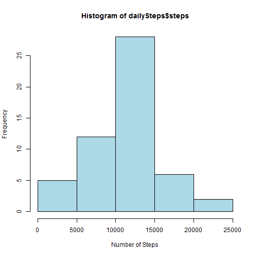
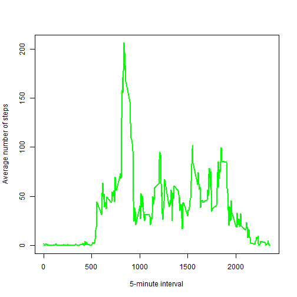
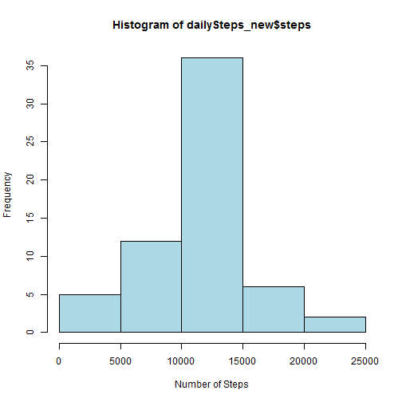
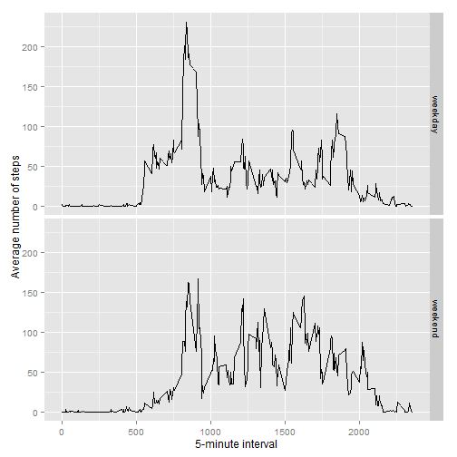

###Loading and preprocessing the data


```r
activity <- read.csv(unz("activity.zip", "activity.csv"))
```

###What is mean total number of steps taken per day?


```r
dailySteps <- aggregate(steps ~ date, activity, sum)
hist(dailySteps$steps, xlab="Number of Steps", col="lightblue")
```



```r
means <- mean(dailySteps$steps, na.rm=TRUE)
medians <- median(dailySteps$steps, na.rm=TRUE)
```

The mean total number of steps is 1.0766189 &times; 10<sup>4</sup> and the median total number of steps is 10765.

###What is the average daily activity pattern?


```r
meanSteps <- aggregate(steps ~ interval, activity, mean, na.rm = TRUE)
plot(meanSteps$interval, meanSteps$steps, type="l", xlab= "5-minute interval", ylab= "Average number of steps", col="green" , lwd=2)
```



```r
maxsteps <- meanSteps[which.max(meanSteps$steps), ]$interval
```

The 5-minute interval, on average across all the days in the dataset, which contains the maximum number of steps is 835.

###Inputing missing values


```r
missingValues <- sum(is.na(activity$steps))
```

The total number of missing values in the dataset is 2304

We will fill in all the missing values with mean value for that 5-minute interval.
This is a function which gets the mean steps for a specific 5-minute interval.


```r
avesteps <- function(interval) {
    meanSteps[meanSteps$interval == interval, ]$steps
}
```

Now we create a dataset, equal to the original but with the missing data filled in.


```r
activity_new <- activity  # Make a copy of the original data
for (i in 1:nrow(activity_new)) {
    if (is.na(activity_new[i, ]$steps)) {
        activity_new[i, ]$steps <- avesteps(activity_new[i, ]$interval)
    }
}
```

Make a histogram of the total number of steps taken each day and Calculate and report the mean and median total number of steps taken per day.


```r
dailySteps_new <- aggregate(steps ~ date, activity_new, sum)
hist(dailySteps_new$steps, xlab="Number of Steps", col="lightblue")
```



```r
means_new <- mean(dailySteps_new$steps)
median_new <- median(dailySteps_new$steps)
```

The (new) mean total number of steps is 1.0766189 &times; 10<sup>4</sup> and the (new) median total number of steps is 1.0766189 &times; 10<sup>4</sup>.
So the mean value is the same in both cases. The median value has increased a little since NA step values where considered as 0 during the estimation and now these zeros have been removed from the histogram.

### Are there differences in activity patterns between weekdays and weekends?


```r
Sys.setlocale("LC_TIME", "English") # Make sure all weekdays are in English
```


```r
weekday_weekend <- function(date) {
    day <- weekdays(date)
    if (day %in% c("Monday", "Tuesday", "Wednesday", "Thursday", "Friday")) 
        return("weekday") else if (day %in% c("Saturday", "Sunday")) 
        return("weekend") else stop("invalid date")
}
activity_new$date <- as.Date(activity_new$date)
activity_new$day <- sapply(activity_new$date, FUN = weekday_weekend)
```

Make a panel plot containing a time series plot of the 5-minute interval (x-axis) and the average number of steps taken, averaged across all weekday days or weekend days (y-axis).


```r
require(ggplot2) 
```


```r
meanSteps_new <- aggregate(steps ~ interval + day, activity_new, mean)
ggplot(meanSteps_new, aes(interval, steps)) + geom_line() + facet_grid(day ~ .) + 
    xlab("5-minute interval") + ylab("Average number of steps")
```


